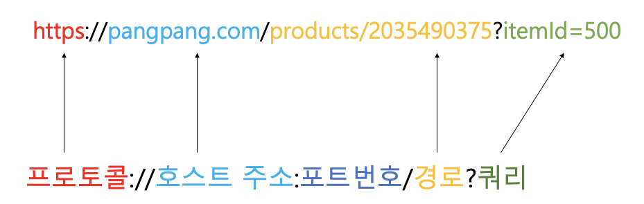
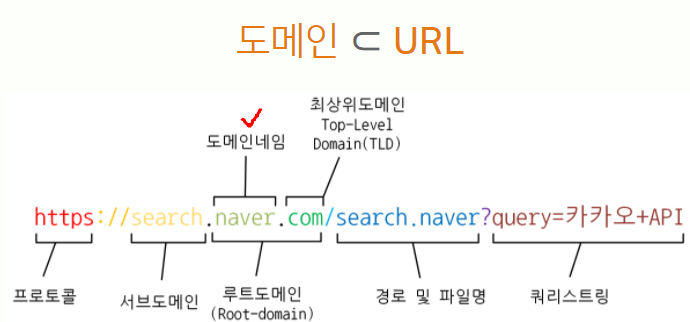

## 브라우저에 페이지가 보이는 과정
1. 사용자가 브라우저에 url 입력
- **url** : 사용자가 원하는 정보 자원을 찾기 위해서 해당 정보 자원의
위치와 종류를 파악해야할 때 사용하는 일련의 규칙이며
이 안에는 네트워크 상에 퍼져있는 특정 정보 자원의 종류와 위치가 기록되어 있다.  

2. url 에서 도메인 name 부분을 DNS 서버에서 검색한다. 
- 도메인 name : DNS에 등록된 이름  
 ex) www.naver.com   
  

3. DNS 서버에서 해당 domain name에 해당하는 ip 주소를 찾아 url 정보와 함께 전달.  
4. 웹페이지 url 정보와 전달받은 ip 주소는 http 프로토콜을 사용해 http 요청 메세지를 생성.  
5. 4번에서 생성된 http 요청 메세지를 tcp 프로토콜을 사용해 인터넷을 거쳐 ip 주소의 컴퓨터로 전송.  
6. 도착한 http 요청 메시지는 http 프로토콜을 사용해 http 응답을 만든다.  
7. 만들어진 http 메시지를 다시 tcp 프로토콜을 사용해 원래 컴퓨터로 전송한다.  
8. 도착한 http 응답 메시지는 http 프로토콜을 사용해 웹 페이지 데이터로 변환.  
9. 변환된 웹페이지의 데이터는 웹 브라우저에 의해 출력된다.  

### 참고 URL : https://donologue.tistory.com/380
