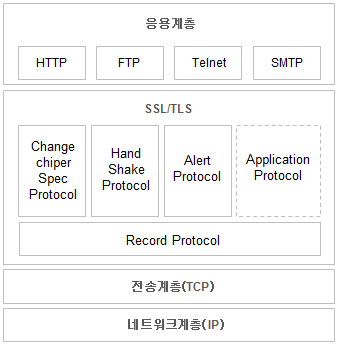

## HTTP
HTTP는 하이퍼 텍스트 전송 프로토콜의(Hypertext Transfer Protocol)의 약자입니다. 서로 다른 시스템들 사이에서 통신을 주고받게 해주는 가장 기초적인 프로토콜입니다.
 

## HTTPS
HTTPS는 하이퍼 텍스트 전송 프로토콜 보안(Hypertext Transfer Protocol Secure)의 약자입니다.
HTTPS는 SSL 또는 TLS 위에 HTTP 프로토콜을 얹어 보안된 HTTP 통신을 하는 프로토콜입니다. 
HTTPS 프로토콜은 SSL(보안 소켓 계층)을 사용함으로써 이 문제를 해결했습니다. SSL은 서버와 브라우저 사이에 안전하게 암호화된 연결을 만들 수 있게 도와주고, 서버 브라우저가 민감한 정보를 주고받을 때 이것이 도난당하는 것을 막아줍니다. HTTP vs HTTPS의 차이는 ‘보안성’에 있습니다.
‘HTTP vs HTTPS 차이’는 바로 SSL 인증서입니다. 사실 HTTPS는 쉽게 말해서 HTTP 프로토콜에 보안 기능을 추가한 것이라고 말할 수 있는데요. 보안 기능은 생각보다 매우 중요합니다. 특히 신용카드 정보나 비밀번호 등 사용자들의 민감한 정보들을 다루는 웹사이트에서라면 더욱 그렇죠.
SSL 인증서는 사용자가 사이트에 제공하는 정보를 암호화하는데, 쉽게 말해서 데이터를 암호로 바꾼다고 생각하면 쉽습니다. 이렇게 전송된 데이터는 중간에서 누군가 훔쳐 낸다고 하더라도 데이터가 암호화되어있기 때문에 해독할 수 없습니다. 그 외에도 HTTPS는 TLS(전송 계층 보안) 프로토콜을 통해서도 보안을 유지합니다. TSL은 데이터 무결성을 제공하기 때문에 데이터가 전송 중에 수정되거나 손상되는 것을 방지하고, 사용자가 자신이 의도하는 웹사이트와 통신하고 있음을 입증하는 인증 기능도 제공하고 있습니다.

SSL(Secure Sockey Layer)란 보안 소켓 계층을 이르는 것으로, 인터넷 상에서 데이터를 안전하게 전송하기 위한 인터넷 암호화 통신 프로토콜을 말한다. SSL은 전자상거래 등의 보안을 위해 넷스케이프에서 처음 개발되었고, 시간이 지나 IETF에 의해 SSL3.0을 이용해TLS(Transport Layer Security)로 표준화 하였다. 즉, 간단히 이야기하면 SSL == TLS이다.(물론 표준화되면서 기능상 차이가 있을 지는 모르지만 결국 SSL를 표준화한 것이 TLS이다.)
 

출처: https://xzio.tistory.com/1630 [코딩창고]